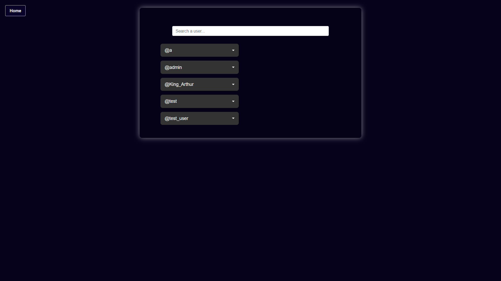

# PROVIDENCE

## Description
Providence is a small social media website where users can write articles and react to them by leaving a like.

## How to run it
`docker-compose` is required.
To launch the website, type the following command:
```
docker-compose up --build
```
You can now explore the wesite by visiting http://localhost


## Additional info

### Database password
To make the database password easier to change we have written it the files `docker-compose.yml` and `config.php`.

You can change the database password by editing the `MYSQL_PASSWORD` parameter in the `docker-compose.yml` file and the `$dbpassword` variable in `config.php`.

### Admin account
The default admin credentials are `admin:admin`.
The password can be changed in the account settings page.

## Features

### Front page

From the front page of Providence, you can search for articles by typing in the search bar or click the `Log In` button to use an account.


### Search
The search bar allows you to search for articles.
It will return the articles containing your search term from newest to oldest.


### Reading articles
By clicking an article, you can read it.
If you are logged in, you can also like the article.


If you are the author of the article or if you are using an administrator account, the "Delete Article" button will appear.


### Log In page
The Log In page allows you to connect to your account if you already have one.


If you don't have an account, you can get to the Sign In page by clicking "Create an account".

### Sign In page
The sign in page allows you to create an account.
Only lowercase alphanumeric character and underscore are allowed for the username.
Creating two users with the same username in a different case is not allowed.


### Article creation
Once logged in, you will have acess to the "Create New Article" button.


This button will lead you to the "Create Article" page where you can write the title of your article and its content.


When your article is sent, the "Article published successfully!" will appear.


### Account Panel
Once logged in, you will have access to the account panel on the top right of the screen in the front page and in the search results page.


From this pannel, you can access :
- **My Articles :** The list of the articles created with your account
- **Liked Articles :** The list of the articles liked by your account
- **Settings :** The account settings page

### Account Settings
This page allows you to use all the features of the account panel and to edit your password.


If you are logged in as an administrator, you will have access to the `Admin Panel` from this page.


### Admin Panel
The Admin Panel will show you the list of all users.



From here, you can search a user and access to their "Liked Articles" or "Authored Articles" page using the drop down menu.


